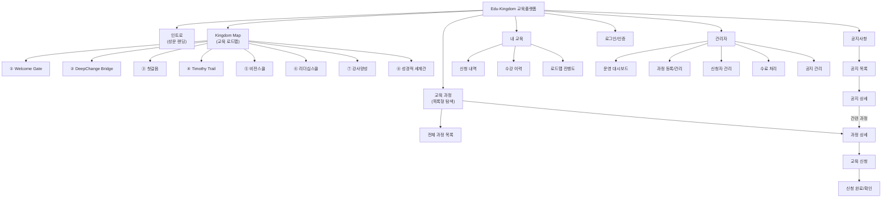
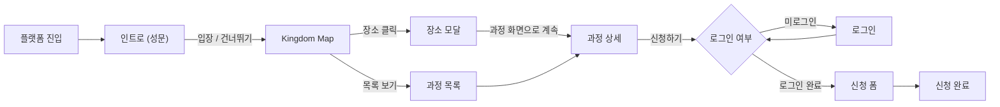
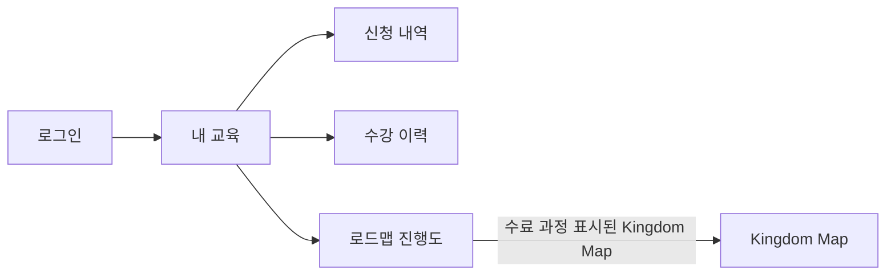
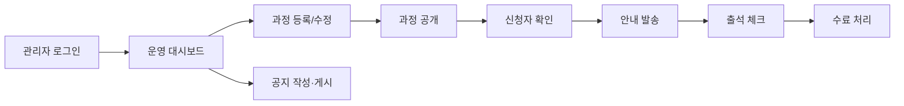

# 교육플랫폼 페이지 목록 및 메뉴 구조

> **문서 구분:** 별첨 참조  
> **작성일:** 2026-09-14  
> **본문 참조:** 교육플랫폼_세부기획안_본문.md Ⅲ.3~4절  
> **변경 이력:** 2026-09-14 1차 구축 범위 확정(DD-08) — 공지사항·관리자 대시보드·공지 관리 추가, 온라인 수료증 2차로 제외  
> **변경 이력:** 2026-09-14 권한·운영 결정 — 공지 관리 화면 확정, 본부 책임자 역할 추가(조회 전용), 공지 게시 본부 승인 없음, 교육 담당자 간 공지 상호 수정 허용

---

## 1. 전체 메뉴 구조도



---

## 2. 사용자별 주요 이동 흐름

### 2-1. 교육 참여자 — 과정 탐색 및 신청



### 2-2. 교육 참여자 — 이력 확인



### 2-3. 교육 담당자 — 과정 운영



---

## 3. 전체 페이지 목록

### 3-1. 사용자 화면

| 화면 ID | 화면명 | 구분 | 접근 대상 | 진입 경로 | 다음 이동 | 비고 |
|---------|--------|------|-----------|-----------|-----------|------|
| **EDU-INTRO-01** | 인트로 (성문 랜딩) | 기존 MVP | 전체 | 직접 URL | Kingdom Map, 건너뛰기 | 입장 애니메이션 포함 |
| **EDU-MAP-01** | Kingdom Map (로드맵) | 기존 MVP | 전체 | 인트로, 네비게이션 | 장소 모달 → 과정 상세 | 8개 장소 인터랙션 |
| **EDU-MODAL-01** | 장소 진입 모달 | 기존 MVP | 전체 | Kingdom Map 장소 클릭 | 과정 상세, 지도 복귀 | 공통 템플릿 (8개 과정 공유) |
| **EDU-COURSE-01** | 과정 상세 페이지 | 기존 → 확장 | 전체 (신청은 회원) | 모달 → 계속, 과정 목록 | 신청, 목록 복귀, 로그인 | 공통 템플릿 + 과정별 차이 |
| **EDU-LIST-01** | 교육 과정 목록 | **신규** | 전체 | 네비게이션, 검색 | 과정 상세 | 목록·검색·필터 |
| **EDU-APPLY-01** | 교육 신청 폼 | **신규** | 회원 | 과정 상세 → 신청하기 | 신청 완료, 취소 → 상세 복귀 | 로그인 필수 |
| **EDU-APPLY-DONE-01** | 신청 완료 / 확인 | **신규** | 회원 | 신청 폼 제출 | 과정 상세, 내 신청 내역, 목록 | — |
| **EDU-MY-01** | 내 교육 (마이페이지) | **신규** | 회원 | 네비게이션, 헤더 | 신청 내역, 수강 이력, 진행도 | 로그인 필수 |
| **EDU-MY-APPLY-01** | 신청 내역 | **신규** | 회원 | 내 교육 | 과정 상세, 신청 취소 | — |
| **EDU-MY-HISTORY-01** | 수강 이력 | **신규** | 회원 | 내 교육 | 과정 상세 | 수료증 발급은 2차 (EDU-MY-02) |
| **EDU-MY-ROADMAP-01** | 로드맵 진행도 | **신규** | 회원 | 내 교육 | Kingdom Map (진행도 반영) | — |
| **EDU-NOT-01** | 공지사항 목록 | **신규** | 전체 | 네비게이션 | 공지 상세 | 분류 필터·검색, 고정 공지 |
| **EDU-NOT-02** | 공지사항 상세 | **신규** | 전체 | 공지 목록, 직접 링크 | 공지 목록, 관련 과정 상세 | 첨부파일 다운로드 |
| **EDU-LOGIN-01** | 로그인 / 회원 인증 | **신규** | 전체 | 신청 시도, 내 교육 접근 | 이전 페이지 복귀 | `[DD-03]` |

### 3-2. 관리자 화면

| 화면 ID | 화면명 | 구분 | 접근 대상 | 진입 경로 | 다음 이동 | 비고 |
|---------|--------|------|-----------|-----------|-----------|------|
| **EDU-ADMIN-DASH-01** | 관리자 대시보드 | **신규** | 교육 담당자, 관리자, 본부 책임자(조회 전용) | 관리자 로그인 | 과정 관리, 신청자 관리, 수료 처리, 공지 관리 | 현재 운영 현황 요약 (기간별 리포트는 2차) |
| **EDU-ADMIN-COURSE-01** | 과정 등록/관리 | **신규** | 교육 담당자 | 대시보드 | 과정 등록폼, 과정 수정 | — |
| **EDU-ADMIN-COURSE-FORM-01** | 과정 등록/수정 폼 | **신규** | 교육 담당자 | 과정 관리 → 등록/수정 | 과정 관리 목록 | — |
| **EDU-ADMIN-APPLY-01** | 신청자 관리 | **신규** | 교육 담당자 | 대시보드, 과정 관리 | 신청자 상세, CSV 다운로드 | — |
| **EDU-ADMIN-COMPLETE-01** | 수료 처리 | **신규** | 교육 담당자 | 대시보드, 신청자 관리 | — | 출석·수료 일괄/개별 처리 |
| **EDU-ADMIN-NOTICE-01** | 공지 관리 | **신규** | 교육 담당자, 관리자 | 대시보드 | 공지 등록/수정 폼, 공지 상세 미리보기 | 목록·등록 폼 한 화면, 담당자 간 상호 수정 가능 |

### 3-3. 공통 요소

| 요소 ID | 요소명 | 설명 | 비고 |
|---------|--------|------|------|
| **EDU-COMMON-HEADER** | 공통 헤더 | 로고, 네비게이션(지도/과정목록/내교육/공지사항), 로그인 상태 | PC: 상단 고정, 모바일: 햄버거 |
| **EDU-COMMON-FOOTER** | 공통 푸터 | 교육연수본부 정보, 문의처, 개인정보처리방침 | — |
| **EDU-COMMON-NAV-MOBILE** | 모바일 네비게이션 | 햄버거 메뉴 → 슬라이드 패널 | — |
| **EDU-COMMON-TOAST** | 알림 토스트 | 신청 완료, 에러, 안내 등 일시 알림 | 자동 사라짐 |
| **EDU-COMMON-CONFIRM** | 확인 모달 | 신청 확인, 취소 확인 등 이중 확인 | — |

### 3-4. 2차 확장 화면 (1차 범위 제외)

| 화면 ID | 화면명 | 제외 사유 | 비고 |
|---------|--------|-----------|------|
| **EDU-MY-02** | 온라인 수료증 발급·조회 | 2026-09-14 1차 범위 제외 결정 (DD-08) | 참고 설계: 화면설계서 부록 |

---

## 4. 화면 ID 규칙

```
EDU - [영역] - [세부] - [버전]

영역:
  INTRO     인트로
  MAP       Kingdom Map
  MODAL     장소 진입 모달
  COURSE    과정 상세
  LIST      과정 목록
  APPLY     교육 신청
  MY        내 교육
  LOGIN     로그인/인증
  NOT       공지사항
  ADMIN     관리자
  COMMON    공통 요소

예시:
  EDU-COURSE-01       과정 상세 v01
  EDU-ADMIN-APPLY-01  관리자 신청자 관리 v01
```

---

## 5. 페이지 수 요약

| 구분 | 페이지 수 |
|------|-----------|
| 기존 MVP (유지·확장) | 4 |
| 신규 사용자 화면 | 10 |
| 신규 관리자 화면 | 6 |
| 공통 요소 | 5 |
| **전체** | **25** |

> 1차 구축 범위 기준입니다. 2차 확장 화면(EDU-MY-02)은 집계에서 제외합니다.

---

## 6. 과정별 차이 정의

8개 교육과정은 **공통 템플릿(EDU-COURSE-01)**을 사용하되, 과정별로 다음 항목이 달라집니다.

| 과정 | 영문명 / 테마 공간 | 고유 배경 이미지 | 카테고리 | 교육 형태 | 과정별 특수 필드 |
|------|-------------------|-----------------|----------|-----------|----------------|
| ① Welcome Gate | 성문 (Gate) | ✅ | 학습 | 오프라인 집합 | — |
| ② DeepChange Bridge | 우물가 (Well) | ✅ | 변화 | 오프라인 집합 | 3단계 구성 (Pause·Draw·Cross) |
| ③ 첫걸음 | 여정 출발점 (Inn) | ✅ | 성장 | `[확인 필요]` | — |
| ④ Timothy Trail | 목장 (Pasture) | ✅ | 신앙 | `[확인 필요]` | — |
| ⑤ 비전스쿨 | 천문대 (Observatory) | ✅ | 비전 | 오프라인 집합 | 기수 표시 (128기 등), 외부 신청 링크 전환 `[DD-04]` |
| ⑥ 리더십스쿨 | 대장간 (Forge) | ✅ | 훈련 | `[확인 필요]` | — |
| ⑦ 강사양성 | 훈련소 (Academy) | ✅ | 사명 | `[확인 필요]` | — |
| ⑧ 성경적 세계관 | 교회당 (Chapel) | ✅ | 신앙 | `[확인 필요]` | — |

> 각 과정의 교육 형태(오프라인 집합/온라인/혼합), 신청 시 추가 수집 항목, 수료 기준 등은 교육연수본부에서 확인이 필요합니다.
